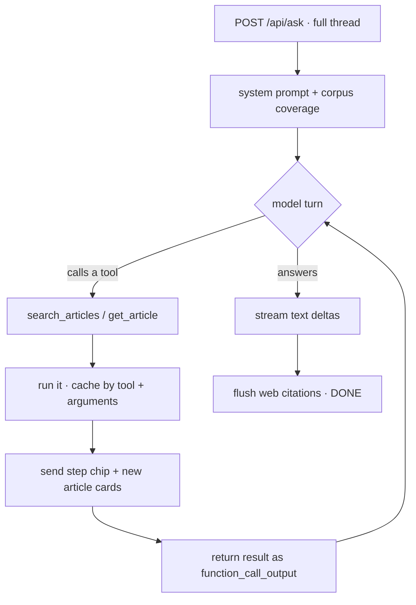
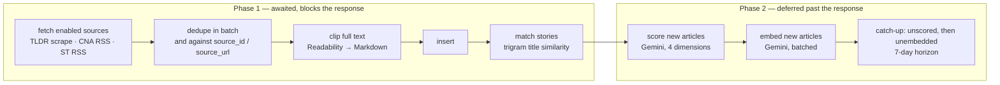

# Architecture

How A Calmer News works under the hood — the pages, the ingest pipeline, retrieval, the data
model, and the design decisions behind them. For setup and a high-level overview, see the
[README](../README.md).

## Contents

- [The pages](#the-pages)
  - [Feed `/`](#feed-)
  - [Article reader `/article/[slug]`](#article-reader-articleslug)
  - [Ask `/ask`](#ask-ask) — the request loop, retrieval, citations, history
  - [Search `/search`](#search-search)
  - [Library `/library`](#library-library)
  - [Settings `/settings`](#settings-settings)
- [The ingest pipeline](#the-ingest-pipeline)
  - [How an article gets clipped](#how-an-article-gets-clipped)
  - [Story matching](#story-matching)
  - [Scoring and embedding](#scoring-and-embedding)
- [Data model](#data-model)
- [API routes](#api-routes)
- [Maintenance scripts](#maintenance-scripts)
- [Design decisions](#design-decisions)

---

## The pages

Six pages. Five of them sit in the floating dock at the bottom of the screen — Feed,
Library, Search, Ask, Settings — and the sixth is the article reader, which hides the
dock because it wants the whole viewport.

### Feed `/`

The day's news, newest day first.

**How it renders.** A server component. It reads the grid/list preference from a
cookie, parses filters out of the query string with the *same* parser the API route
uses (`lib/feed-query.ts`), and awaits `getFeedPayload()` directly — so the first
screen arrives as finished HTML with no client fetch. That payload is seeded into
SWR under exactly the key the client hook will mount on, so the browser does not
immediately re-request what it was just handed.

Only that one key is seeded, deliberately. Seeding the dated key the hook re-keys to
a moment later would make the cold load free, but a seeded key is not revalidated,
so the newest day — the one the crawler is still appending to — would stay frozen at
whatever had been filed when the page was built. What is left is
stale-while-revalidate: the first screen paints from the payload, then the real fetch
happens off the critical path.

Nothing on the page suspends, either. A Suspense boundary here (which reading the URL
on the client used to require) made React flush the shell first and stream the feed in
behind it, so the page painted blank and then swapped a few hundred kilobytes of
articles in at once — a flash that grows with the number of articles.

A dateless request means **the newest day**, not the whole archive. Answering it
literally would ship thousands of articles for a page that shows one day of them.
Search is the exception, because reaching across days is the point of it.

**How it refreshes.** On the first mount of a page load (a module-level flag, so
back-navigation is silent), `Feed.tsx` fires `POST /api/fetch` — which starts the
ingest pipeline or joins one already running — and refetches only if new articles
actually landed. Separately, an hourly cron inside the server process runs the same
pipeline. The feed also revalidates when you come back to the tab, throttled to 30
seconds, because read marks are shared and another device may have dimmed a card.

While a freshly ingested article is still waiting on its relevance score, the feed polls
once a minute so it re-sorts into place on its own; the poll returns to zero as soon as
nothing recent is unscored, so an idle feed makes no background requests at all.

**What a card knows.** Each row carries its own read state — an `EXISTS` subquery per
row, not a set of marks shipped to the browser — plus its relevance score and story
group. Articles sharing a `story_group` collapse into one card, with the other
outlets tucked into a source switcher: CNA and The Straits Times covering one event
is one story, not two. An article whose body could not be clipped is tagged
`*summary`, so you know the card is all there is before you open it.

**Controls:** feed tabs (All / Singapore / World / Asia / Finance / AI / Tech), a
date navigator, sort (Relevance / Latest / Oldest), an in-feed search box, and a
grid/list toggle. Every card has a menu — its own button, or right-click anywhere on
the card — for share, download, mark read/unread, rescore, and delete.

### Article reader `/article/[slug]`

Server-fetches the article row and its clipped Markdown body, then renders it with
`react-markdown` + GFM + syntax highlighting.

Raw HTML is promoted by `rehype-raw` and then filtered by `rehype-sanitize` against a
custom schema. That boundary is real rather than ceremonial: the clipper preserves
Flourish and Datawrapper **data-visualisation** embeds as iframes, and the schema
allows `<iframe>` *only* with a `src` matching those two hosts — an iframe pointing
anywhere else keeps its tag but loses its `src`, so it loads nothing. The same
allow-list is enforced in three places (the clipper tells Readability to keep those
embeds, the schema decides what survives rendering, the `EmbedIframe` component
decides what gets mounted) because each catches what the others cannot.

The reader has a **chat panel** — a side panel on desktop, a full-screen sheet on
mobile — backed by `POST /api/chat`. Unlike Ask, it needs no retrieval: the entire
article is pasted into the system prompt, so the model is grounded by construction.
It can still reach for OpenAI's web search to fill in background the article assumes,
or developments since it was published.

Also here: download as Markdown (`/api/markdown`, prefixed with a short source/date/reading-time
header) or PDF, and share via Telegram — either the original source URL or your own archive link.

`/api/pdf` re-renders the same Markdown to standalone HTML — styled to match the reader, fonts
included — and posts it to Gotenberg. The sanitiser is load-bearing on that path in a way it is
not in the reader: none of the React component overrides apply, so `EmbedIframe`'s host check
never runs, and what comes out is handed to a real Chromium inside the compose network that will
execute scripts and fetch whatever a `src` points at. The schema is the only thing between a
scraped page and that browser.

### Ask `/ask`

The interesting one. A chat against the whole archive, where the model cannot see
anything until it searches for it.

#### The request loop

`POST /api/ask` is **stateless**: the browser sends the entire thread every time and
the route stores nothing. The server prepends a system prompt that describes what the
archive actually covers — earliest date, latest date, total articles, and the average
per day. The rate matters as much as the span: 3,000 articles across two years and
across two months support very different readings of a gap, and without it the model
cannot tell a quiet week from a week outside what you collect.

It then runs a turn loop, streaming everything back over SSE:



Two budgets bound a reply: **6 turns** and **14 tool calls**. Turns alone are not a
budget, because the model issues several calls per turn — one observed run spent 17
of them, thirteen searches, five returning nothing, before answering. Each search
costs a query embedding against a 1,000-per-day allowance, so an unbounded appetite
for searching is what would actually exhaust the free tier.

Identical calls are served from a per-reply cache. The model repeats itself, sometimes
twice in one turn, and every repeat used to re-run the query, spend another embedding,
and show the reader the same search again. The call is still *answered* — the API
pairs one output to every `call_id` — but only the result is reused.

When the budget runs out, tools are **not** withheld. They stay declared and
`tool_choice` flips to `"none"`. Removing the definitions makes the model emit raw
call syntax (`to=functions.get_article`, `multi_tool_use.parallel`) as literal answer
text, because it still intends to call a tool and no longer has a channel for it.
Declared-but-forbidden is a state it understands. The same trick forces a final answer
if the turn limit arrives while tools are still pending, so you get a reply rather than
a list of searches and silence.

Tools: `search_articles`, `get_article`, and OpenAI's `web_search_preview`. The prompt
makes the archive primary and the web supplementary, insists the reader can tell which
is which, and requires every source to be a markdown link — archive articles as
`/article/the-slug`, web sources as full URLs.

#### How retrieval actually works

`search_articles` → `lib/retrieval.ts` → `hybridSearchArticles()` in `lib/db/queries.ts`.

This is a *sibling* of the search page's query function, not a variant of it. A page
wants precision — exact hits, highlighted terms, stable paging. A model wants recall,
because it can read twenty candidates and silently discard the poor ones. Serving both
from one ranking function would compromise each. Nothing here returns highlights,
reading times or offsets: it returns the least text that lets a model decide what to
cite, because the output is spent against a context window.

**1. The question becomes a vector.** Gemini embeds it with `taskType:
RETRIEVAL_QUERY` — questions and the passages that answer them only land in the same
neighbourhood if each is embedded as what it is — truncated to 1536 dimensions. An
in-process LRU cache of 200 query vectors absorbs the model re-asking the same thing
across turns. If embedding fails (the daily allowance is small enough to actually run
out), retrieval degrades to lexical-only rather than failing the reply.

**2. Two arms run inside one SQL statement.**

| | Lexical arm | Semantic arm |
|---|---|---|
| Matches | `websearch_to_tsquery` over a weighted `tsvector` — title **A** > summary **B** > body **C** | pgvector cosine distance against `articles.embedding` |
| Index | GIN on `search_vector` | HNSW, `vector_cosine_ops` |
| Ranked by | `ts_rank_cd` | distance, with a floor of 0.55 similarity |
| Good at | proper nouns — "Nvidia", "H20" | paraphrase — "semiconductor curbs" → "chip export restrictions" |
| Blind to | paraphrase | exact names |
| Candidate pool | top 60 | top 60 |

An unparseable or stop-word-only query is not fatal here, unlike on the search page:
the lexical arm simply contributes nothing and the semantic arm still answers, which
matters when the caller is a model writing its own queries.

The similarity floor does more work than it looks. Without it the semantic arm *never*
returns nothing, because something is always nearest in vector space — an off-topic
question came back with twelve unrelated articles. That breaks a promise the system
prompt makes: the model is told to say plainly when the archive has nothing on a
topic, and it could never observe that case, because "no coverage" and "twelve weak
matches" looked identical. 0.55 was measured rather than guessed. Real questions about
the corpus peak at 0.69–0.75 and keep all 60 candidates; questions with no possible
answer here ("sourdough starter hydration") peak at 0.54 and lose all 60. At 0.60
genuine matches start being cut; at 0.50 two-thirds of the noise comes back.

**3. Reciprocal Rank Fusion.** The arms are fused on *rank*, not score:

```
score(doc) = 1/(60 + lexical_rank) + 1/(60 + vector_rank)
```

No incomparable scales to normalise, no weights to tune. `k = 60` is deliberately large
relative to the pool: it flattens the curve so that *whether both arms surfaced the
article* matters more than its exact position within either, which is what makes fusion
robust without per-arm normalisation. A `FULL OUTER JOIN` means an article found by
only one arm still competes. The pool is generous relative to the dozen finally
returned, because fusion can only reward overlap — a pool too small to overlap collapses
RRF into two interleaved lists.

**4. Post-processing.** Same-story duplicates collapse to the best-ranked copy: two
outlets on one event is not two pieces of evidence, but to a model reading a flat list
it looks like corroboration, and repetition inside a context window reads as
importance. A 12,000-character budget then trims the tail, and the result is sliced to
the requested limit (12 by default, 30 maximum).

Only *after* that slice does one batched query name every **other** outlet that carried
each surviving story, which the model sees as `[also reported by ...]`. Reading this
from the story group rather than from what ranked is the difference between "one outlet
reported this" and the truth — the second outlet's copy frequently misses the question's
wording and never enters the result set, which understated corroboration on 40% of
grouped stories when it was inferred from ranking alone.

**5. Browsing instead of searching.** Omit `query`, pass a date range, and the call
becomes `listArticlesByDate` — the window newest first, ordered within a day by
relevance score (falling back to insertion order for articles the scorer has not
reached). This is how "what happened today" and "summarise this week" are answered.
Topic search cannot do it: searching the word *"news"* scoped to one day returned 12 of
that day's 110 articles, one of which was among the twelve the day actually led with —
and nothing in the result admits it is a 1-in-9 sample.

`get_article` pulls one full body by slug, capped at 8,000 characters, for quoting or
when a summary is not enough to answer accurately.

Tool calls never throw. A failure returns a message the model can read and work around,
because an exception would abort a reply that is already half-streamed to the reader.

#### What the page shows

As the reply streams, each search appears as a **step chip** naming the query, its
scope, and how many articles came back. Article cards appear under it as they are
found, deduplicated across searches — the same article surfaces for several phrasings.

Once the answer is complete, the cards are split into **cited** and **not cited**,
determined by scanning the answer for `/article/<slug>` links, since the slug is the one
part of a citation the model cannot paraphrase. The split is the point: one real
question ran four searches and put 45 cards under a reply that cited nine, with nothing
marking which nine. What was cited is the evidence; what was not is how you tell a thin
*answer* from a thin *search*. Web citations accumulate across every turn and are listed
once at the end.

#### Conversation history

The thread on screen lives in `sessionStorage`, so a refresh — or a trip to an article
and back — restores it in the first frame rather than behind a spinner. It stores the
conversation's id alongside the messages, so a restored thread keeps saving into the row
it came from instead of forking a copy on every refresh.

After each exchange the client PUTs the whole thread to `/api/conversations/[id]`. The
browser mints the UUID, which is what makes the save one idempotent upsert rather than a
create-then-update pair — there is no moment where the client knows whether the row
exists, and no round trip in which to find out. A signature check (id, message count,
last message length) keeps settled re-renders from becoming writes.

The row stores `ChatMessage[]` as a single `jsonb` document — retrieval steps and article
cards included, so a reopened chat keeps its working and its sources. A messages table
would buy per-message addressing nothing here uses: the list needs a title and a
timestamp, and opening a chat needs all of it. `sanitiseMessages` is the boundary,
copying fields across one at a time and capping thread length, so the endpoint is not an
arbitrary JSON store reachable from the page.

A title is generated once, from the first exchange only (2,000 characters of the
question, 4,000 of the answer — measured; reading further changes nothing because an Ask
answer opens with a paragraph summarising itself). It is never revised, because a title
that re-summarised as the chat grew would rename rows you had already learned to find. If
the model is unavailable, the opening question becomes the title, which is never *wrong*
about the chat — only longer than a written title would be — so nothing retries.

Switching conversations mid-reply does not cancel the reply. It is **detached**: it
finishes in the background and is saved against the conversation it belongs to, so
leaving a slow answer to read something else does not throw it away.

### Search `/search`

The precision counterpart to Ask's retrieval, over every day on record.

- **Matching:** `websearch_to_tsquery` against the same weighted vector, ranked with
  `ts_rank_cd` so title hits beat body hits — `"quoted phrases"`, `-exclusions` and `or`
  all work. An in-page tips panel lists the syntax, and every example in it is checked
  against the real archive first: a tip that returns nothing teaches nothing, and one
  whose filter barely moves the count teaches the opposite of its point.
- **Highlighting:** `ts_headline` wraps matched terms in sentinels (`[[HL]]`), which the
  client parses — never injected as HTML. Markdown links and inline markers are stripped
  before the snippet is cut, so excerpts don't come back full of `[text](url)`.
- **Outlet search:** `source_domain` is not in the tsvector, so a trigram `ILIKE` is OR'd
  in and `straitstimes` finds the outlet. ILIKE metacharacters are escaped, so searching
  `100%` finds an outlet containing "100%" rather than returning the archive.
  Domain-only hits score 0 and sort below genuine text matches.
- **Typo tolerance:** when full-text returns nothing, a probe separates "the query reduced
  to stop words" from "nothing matched". Only the second falls back to trigram word
  similarity against titles, and the UI says so (`mode: "fuzzy"`). Running off the end of
  a paginated result never falls back, so "load more" cannot append fuzzy matches to a
  query that has exact ones.
- **Scope:** feed, an inclusive date range from a calendar, sort, and a **Library** scope.
  Search is the one place pasted pages are not excluded — here you are looking for an
  article, not reading the day's news, so a page you saved is as valid an answer as a
  fetched one.
- **Paging:** offsets advance by *rows consumed*, not cards rendered, because story
  grouping shrinks the page. Copies of a story that straddle a page boundary are folded
  into the existing card's source switcher rather than appearing as a second card.
- **Complete groups:** grouping can only collapse what a page contains, so one extra
  batched lookup fills in copies that ranked below the boundary — scoped by the caller's
  filters, unlike Ask's version, because these are whole articles you can open and a feed
  or date filter has to hold.

### Library `/library`

Your own clippings, plus anything from the feed you chose to keep.

Paste a URL — ⌘V works anywhere on the page, not just in a field — and `POST /api/library`
fetches it, extracts the readable article with Mozilla Readability, converts it to
Markdown with Turndown (GFM tables, fenced code, trusted iframes preserved), and derives
everything a card needs — title, summary, reading time, domain — **without a model call**,
since the library is reader-paced and unbudgeted while the Gemini quota is neither. A
page's own meta description wins over its opening lines as a summary only if it is long
enough to be about *that page* rather than the whole site.

It is deliberately one slow request rather than a job the client polls: you pasted one
link and are watching one placeholder card, which says everything a progress endpoint
would.

Guards worth knowing about:

- **SSRF.** This is the only fetch in the app aimed by whoever is looking at the page, and
  the server sits on a private network with a database and the cloud's instance metadata
  service (`169.254.169.254`) around it. Literal loopback, link-local, private IPv4
  ranges, ULA/link-local IPv6 and `.local` / `.internal` / `.home` / `.lan` are refused. A
  public hostname that *resolves* to a private address still gets through — closing that
  needs a resolve-then-connect check; this is the proportionate half.
- **Tracking parameters** (`utm_*`, `fbclid`, `gclid`, `igshid`, …) are stripped before
  storage, so the same article cannot be saved twice under two URLs that differ only in
  how it was shared.
- **A URL the pipeline already fetched is saved, not refused.** Only a URL already *in the
  library* comes back as a duplicate, because then there is nothing left to do.
- **Origin and membership are separate.** `feed = 'library'` means you pasted it;
  `library = true` means you kept it. A saved Straits Times story is in your library *and*
  still in Thursday's feed, still scored, still grouped with the other outlets that ran it.
  Removing a pasted page deletes it (it existed only because you saved it); removing a
  saved feed article just unsaves it.

The list is unpaginated and ordered by `saved_at`, not `created_at` — for a saved feed
article `created_at` is when the pipeline ingested the story, which would file last week's
news a week down a library it entered this morning.

### Settings `/settings`

Rendered per request, because its whole job is to show what is switched on *right now* —
a build-time snapshot would show the state the image was built with. Switches are drawn
in the position the server already knows them to be in, since a switch that rendered off
and flicked on a moment later reads as the page having changed the setting.

- **Sources**, grouped under the feed they file into (the grouping you actually think in:
  "am I still getting Singapore news, and from whom"). The registry in
  `lib/feed-sources.ts` is the source of truth for *what exists*; the `feed_sources` table
  records only what you switched *off*. A source added to the code arrives enabled, with
  no migration and no seed row.
- **Read marks** on or off. Switching off clears every mark in the same request — that is
  what the page promises in as many words, and doing it server-side means it cannot
  half-happen.

---

## The ingest pipeline

Triggered hourly by `node-cron` inside the server process, and once per fresh load of the
feed page. Overlapping runs are ordinary rather than an edge case, so a run for a given
date joins the one already in flight instead of repeating every source fetch, a second
round of clipping, and another story-matching pass.



**Phase 1** is everything needed for articles to appear in the feed. **Phase 2** is the
rate-limited tail: the HTTP route defers it with `after()` so the request stays well under
a reverse proxy's ~100s limit and the feed's auto-refresh still fires, while the cron —
which has no response to race — awaits it inline. Both callers share one memoised
`finalize`, so a joined run cannot report itself complete while scoring is still going.

**Sources.** Ten in the registry: two TLDR sections, four CNA feeds, four Straits Times
feeds. TLDR is *scraped* from dated digest pages rather than pulled from RSS, and each run
re-checks yesterday's digest too, because today's often isn't published when the early
cron fires (the dated URL 307s to the undated section page until then, which the scraper
detects instead of silently parsing the wrong page). Which sources run is read from the
database on every run rather than captured at import, so a change on the settings page
takes effect on the next tick rather than after a restart.

**Deduplication** is by `source_id` — a stable identifier extracted per outlet (CNA's
numeric article id, ST's URL path, the full URL for anything else) — and by `source_url`,
both uniquely indexed. A story already stored is skipped, but a retitled or moved one has
its metadata updated *and* is re-clipped from the current URL, which is the one path that
can rescue an article whose clip failed at ingest.

### How an article gets clipped

`clipArticle()` fetches the page, runs Mozilla Readability over a JSDOM document, and
converts the result to Markdown. The interesting parts are what it does around that:

- **Paywalls are judged on output, not on the label.** `"isAccessibleForFree": false` is a
  metering declaration aimed at crawlers, and metered publishers set it on pages whose body
  they ship in full anyway — CNN does exactly that, ~5,600 characters and all. So the flag
  only raises the bar: a page that declares itself paywalled must produce 1,500 characters
  to be believed, against an ordinary floor of 100. A Straits Times teaser lands between
  350 and 1,100; an ordinary CNA article between 1,900 and 2,800. The threshold sits in the
  gap.
- **Marker phrases** ("sign up or log in to continue reading", …) catch the teasers long
  enough to clear that floor. Checked *after* the length test, because most publishers cut
  an article off silently and only length gives them away. The same list is reused as SQL by
  the repair script, so adding a phrase takes effect in both places.
- **Tweets** are followed rather than embedded: if the tweet links to an external article,
  that article is clipped instead. oEmbed only returns truncated tweet text, so there is no
  fallback worth taking. Hacker News item pages are skipped outright — a self-post is a
  thread, not an article.
- **Flourish and Datawrapper embeds** are converted to iframes *before* Readability runs,
  which would otherwise strip them, and `<noscript>` images are promoted into the DOM so it
  can see them.
- **Fragmented paragraphs** — the Straits Times wraps sentence fragments in separate `<p>`
  tags — are merged back into sentences by looking at terminal punctuation and leading case.
- **Hero images** are prepended from `og:image` for CNA and ST, whose hero images load via
  JS and so are invisible to Readability.
- **`<` is escaped** in text nodes. Turndown escapes markdown syntax but has no rule for
  `<`, so an article *about* HTML would store a literal tag, and `rehype-raw` downstream
  would promote it to a real element — the words vanishing from the sentence and becoming
  markup.
- **A failed clip is not a failed article.** The body becomes a single link to the original,
  `clipped` stays false, and the card renders with a `*summary` tag. `scripts/reclip.ts` can
  retry the failures later.

### Story matching

Articles are paired by trigram title similarity within a single day — threshold 0.5 across
outlets, 0.7 within one. It runs in passes until nothing new is grouped (which is what
handles transitive matches: A↔B, B↔C → one group), normalises every member onto one
canonical key, then merges groups that turn out to be the same story — the case where two
CNA articles and two ST articles each pair within their own outlet first.

The group key is one member's slug, but it is **opaque**: only ever compared for equality,
never joined back to `slug`, because deleting that member leaves the survivors pointing at a
slug that no longer exists. Which slug becomes the key carries no meaning — who represents a
story on screen is decided downstream by sort position or fused rank.

Matching is scoped to the dates a run actually *touched*, which is what keeps it affordable.
Pairs only ever form within a day, so a group can only change on a day that gained an article
or had one retitled; every other day is provably settled. A rolling window instead spent
~500ms every hour re-comparing the ~87% of articles that are simply unique, and a run that
finds nothing new now does no work here at all.

### Scoring and embedding

**Relevance scoring** asks Gemini for four integers — relevance to your stated interests
(0–40), impact (0–25), uniqueness (0–10), actionability (0–25) — and stores the total as
0.0–10.0. Interests live in `lib/interests.ts`; that file is the knob for retuning what the
feed prioritises.

**Embedding** indexes title + summary + the first 2,000 characters of the body. Title and
summary alone average ~200 characters — enough to place an article's topic, not enough to say
what it actually claims, which is what a question needs to match against. Reaching further
would blur the specifics back out, since one vector averaged over 4,000+ characters says less,
not more. The recipe lives in one function so the live pipeline and the backfill script cannot
disagree — two recipes in one column would degrade ranking silently.

**Quotas are treated as a first-class failure mode.** Each model gets its own sliding-window
limiter, because Gemini's quotas are per-model and sharing one would make scoring and
embedding throttle each other for nothing: scoring paces at 14 requests/minute, embedding at
60 requests/minute *and* 25,000 tokens/minute (batching a request is a latency win only — the
free tier counts each item, not each HTTP call). 429s are retried on the delay the server
asks for, and a *daily* cap is recognised as distinct from a per-minute one: it stops the run
rather than grinding against a wall that will not move before midnight.

Failures leave `relevance_score` / `embedding` null, and null **is** the retry queue. After
handling today's articles — today's news outranks patching last Tuesday — each run repairs up
to 20 unscored and 100 unembedded articles from the last 7 days, and skips either pass
entirely once that model's daily allowance is gone.

---

## Data model

Five tables. No `user_id` anywhere: this is a single-reader app, and accounts, if they ever
arrive, are one migration adding the column to three of them.

| Table | What it holds |
|---|---|
| `articles` | Everything. Metadata, clipped Markdown body, `relevance_score`, `story_group`, a generated weighted `search_vector`, and a `vector(1536)` embedding alongside the model that produced it. |
| `conversations` | One Ask thread per row — messages as `jsonb`, titled once, ordered by `updated_at`. |
| `read_marks` | A row means read; no row means unread. `ON DELETE CASCADE` from `articles`. |
| `feed_sources` | Sparse overrides — a row exists only for a source you switched off. |
| `settings` | Key/value app switches (currently just read marks). |

**Slugs** are the slugified title plus ten hex characters of `sha1(source_id)`. The suffix is
what keeps two articles with identical headlines apart, since `source_id` is itself unique. It
is minted once at insert and never regenerated: when a feed retitles a story the pipeline
updates the title and leaves the slug alone, so a URL you have open — or cited in an Ask
answer — does not rot.

**`search_vector` is a generated column**, so an article is indexed over its full body from
the moment it is stored; nothing has to remember to reindex.

Indexes worth knowing about, all on `articles`:

- GIN on `search_vector` — the full-text arm of both search paths.
- **HNSW** on `embedding`, not IVFFlat. IVFFlat needs representative rows to train its lists
  and periodic rebuilds as the corpus grows, and underperforms a sequential scan at this size.
  HNSW needs neither.
- Trigram GIN on `title` (the fuzzy fallback) and on `source_domain` (outlet search — it also
  lets the domain `OR` resolve as a BitmapOr across both indexes instead of a sequential scan).
- Unique on `source_url` and `source_id` — the constraints that turn a race between two
  concurrent pipeline runs into a logged duplicate rather than a second copy.
- A **partial** index on `saved_at WHERE library`: the library is a handful of rows in a table
  of news, and this is the only query that wants them, so the page reads in display order with
  no sort.

**Migrations run themselves.** `src/instrumentation.ts` applies the `drizzle/` folder before
the first request, then starts the scheduler — which makes `docker compose up` the whole
deploy, and is the only option that works for a production database publishing no port. A
failed migration exits the process in production rather than serving past it, so a container
that will not stay up is the signal to read the logs, and `restart: unless-stopped` turns a
database that was merely slow to start into a few retries.

---

## API routes

| Route | Method | Purpose |
|---|---|---|
| `/api/articles` | GET | Feed payload for a set of filters. |
| `/api/fetch` | POST | Run — or join — the ingest pipeline. |
| `/api/search` | GET | Full-text search with highlights and paging. |
| `/api/ask` | POST | Archive chat. SSE: text deltas, step chips, article cards, sources. |
| `/api/chat` | POST | Single-article chat. SSE. |
| `/api/conversations` | GET | Ask history, titles only. |
| `/api/conversations/[id]` | GET · PUT · DELETE | Read, upsert, delete one thread. |
| `/api/library` | GET · POST · DELETE | List, clip a pasted URL, remove (delete if pasted, unsave if from the feed). |
| `/api/read-marks` | PUT · POST | Mark one article; throw the feature switch. |
| `/api/settings/feeds` | GET · PUT | Read the source roster; patch switches. |
| `/api/markdown` | GET | Download an article as `.md`. |
| `/api/pdf` | GET | Render an article to PDF via Gotenberg. |
| `/api/delete-article` | POST | Hard-delete a row (reports whether it was in the library). |
| `/api/rescore-one` | POST | Re-run relevance scoring for one article. |
| `/api/backfill` | POST | Score unscored articles (`?force=true` rescores everything). |
| `/api/embed-backfill` | POST | Embed up to 50 pending articles per call. |

`/api/read-marks` has no GET, deliberately: read state travels with the articles, so nothing
ever needs the marks as a set, and an endpoint answering "all of them" would invite a payload
that grows with everything ever opened.

---

## Maintenance scripts

The commands are listed in the [README](../README.md#maintenance-scripts).

These are scripts rather than routes because a full pass runs for tens of minutes and no HTTP
request survives that. All are safe to interrupt and re-run — progress is written as each chunk
completes, and the next run picks up whatever is still null. The `/api/*-backfill` routes stay
the way to top up the handful of articles a failed pipeline pass left behind.

`reclip` walks the *most recent* failures first: the far end of the backlog fills with articles
that can never clip (subscriber-only publishers, real paywalls), so a limited run rescues more
at the near end.

---

## Design decisions

The recurring ideas, stated once here because they explain most of the code:

**Origin and membership are different questions.** `feed = 'library'` records where an article
came from; `library = true` records that you kept it. An earlier column tried to mean both, which
made saving a feed article impossible to express. The archive-vs-clippings split is enforced in
exactly one place per path — `pipelineOnly` in the query builder, `PIPELINE_ONLY` in raw SQL —
and the search page is the single deliberate exception.

**Null is the retry queue.** Unscored and unembedded articles are simply null, and every
catch-up pass is a query for them. Nothing records failures separately, and nothing overwrites a
good value with a failure — a rescore that cannot run returns 503 rather than erasing the score
it has.

**Sparse tables mean defaults live in code.** `feed_sources` holds only what you switched off;
`settings` holds only what you changed. A table storing the full roster would need a migration
for every new source — and a source present in code but missing from the table would silently
never be fetched, which is the failure mode hardest to notice.

**The archive is filed in Singapore time.** `articles.date` is a Singapore day, and everything
that compares against it — including "today's date" in a system prompt — goes through
`lib/dates.ts`. The container sets no `TZ`, so Node runs UTC and names the wrong day for the
eight hours after local midnight, which is exactly when the overnight crawl runs.

**Read state travels with the row.** Every query returns each article's own `read` flag, so no
set of marks is ever shipped to the browser and a page costs the same after ten years of reading
as it does today. The session's own clicks are held at module scope rather than in component
state, because the router restores a cached feed on back-navigation and React state would have
been thrown away with it — leaving the one card you know you just read undimmed.

**One definition, two callers.** Feed filters are parsed by one module shared between the page
and the API route; the embedding recipe by one function shared between the pipeline and the
backfill; the truncation phrases by one list read as both regex and SQL; the search page size by
one constant. Each of these had already drifted, or was one copy away from it.

**Degrade rather than fail.** No query vector means lexical-only retrieval. A search that finds
nothing means one differently-worded retry and then an honest "I could not find it", never a
claim that the archive lacks the topic. A failed clip means a link and a `*summary` tag. A failed
tool call means a message the model can read and work around. The only thing that exits is a
failed migration, because serving past that is worse than not serving.

**The source files are the documentation.** Non-obvious decisions are explained in comments where
the decision lives — most of this document is a summary of those.
